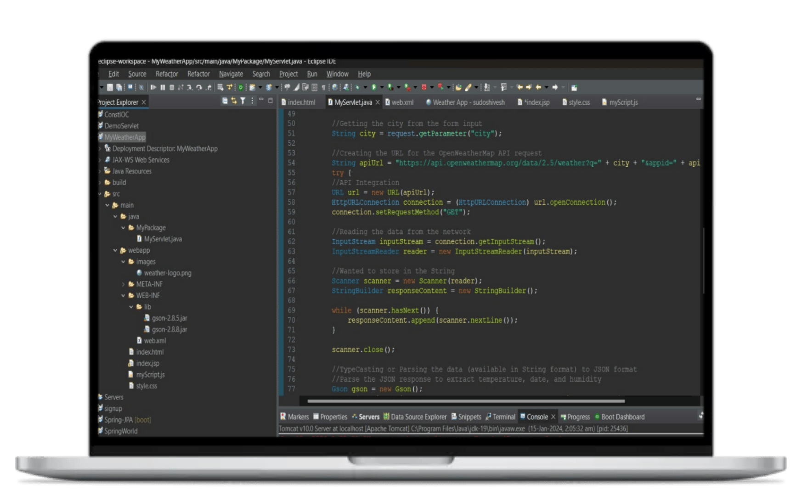
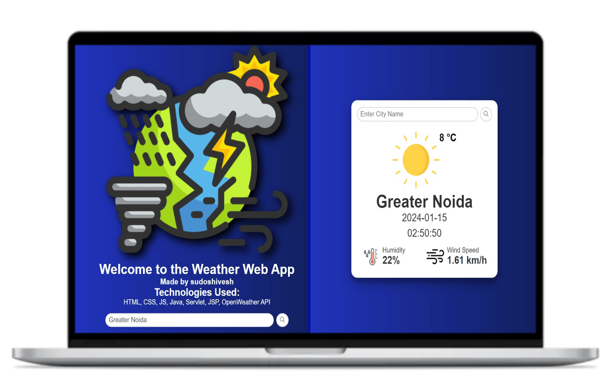
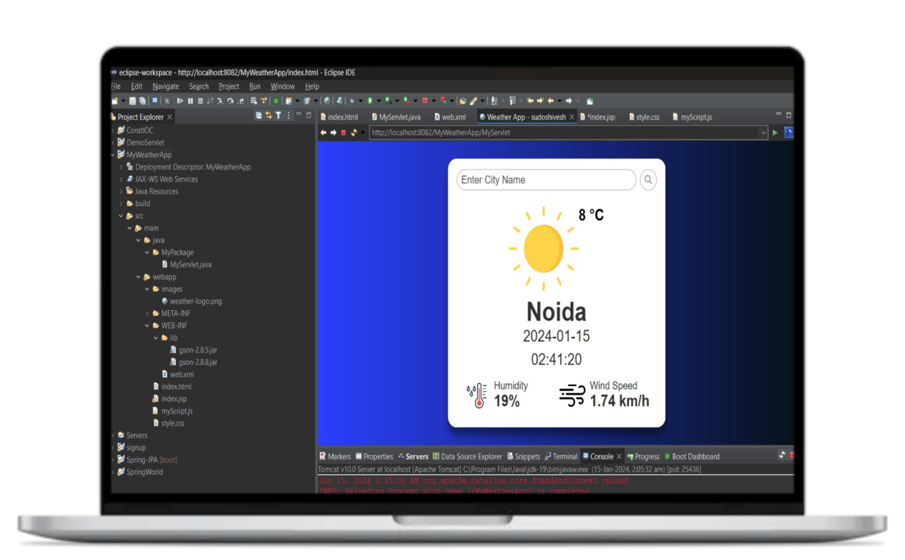

# SkySense - A Weather App using Java and OpenWeatherAPI

## Introduction
Introducing SkySense, a Java-based web app powered by JSP and Servlets, seamlessly integrating OpenWeatherAPI. This application provides real-time weather updates, showcasing temperature, date, time, humidity, and wind speed. With intuitive location-based search functionality, WeatherJ ensures a user-friendly experience for staying informed about weather conditions.

## Dependencies

* [Java Editor](https://www.eclipse.org/downloads/), [OpenWeatherAPI](https://openweathermap.org/api), [Apache Tomcat Server](https://tomcat.apache.org/)
* You're requested to use your own generated API key.

* First, clone the repository and enter the folder

  ```bash
  git clone https://github.com/sudoshivesh/LookSense.git
  cd SkySense
  ```
  
*The folder structure is shown in the snapshot attached in this readme file.

* The snapshot of the output is given below:

  
  
  

  

* For any query, You may conatct [Shivesh](https://wwww.linkedin.com/in/sudoshivesh/)
